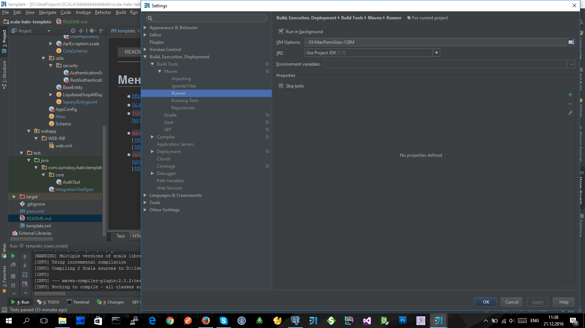

#[Меняем Java на Scala. Базовое приложение](https://habrahabr.ru/post/230451/)

> Это SCALA-web-приложение с примером **интеграционных тестов** [https://habrahabr.ru/post/230451/](https://habrahabr.ru/post/230451/)  **(** [Scala Habr Template](https://bitbucket.org/andy-inc/scala-habr-template) **)**.
> Здесь применяются:
>
> * jdk-1.7.0
> * mvn: 3.2.5
> * PostgreSQL

1. (ошибка в IntelliJIDEA-14 `Scala import not working - object Database is not a member of package`):
   - чтобы исправить нужно в **pom.xml** добавить изменения **plugin** [http://stackoverflow.com/questions/24448582/my-mixed-scala-java-maven-project-doesnt-compile](http://stackoverflow.com/questions/24448582/my-mixed-scala-java-maven-project-doesnt-compile)
                                                                          **(** [http://stackoverflow.com/questions/21701452/scala-import-not-working-object-database-is-not-a-member-of-package-com-me-pro](http://stackoverflow.com/questions/21701452/scala-import-not-working-object-database-is-not-a-member-of-package-com-me-pro) **)**
2. (ошибка в IntelliJIDEA-14 `java.lang.OutOfMemoryError: PermGen space...`):
   - чтобы исправить нужно в **IntelliJIDEA** >> **Settings** >> **Maven** >> **Runner** нужно добавить  ' **-XX:MaxPermSize=128M** '
     [http://stackoverflow.com/questions/19750340/solve-permgen-errors-when-building-in-intellij-with-maven](http://stackoverflow.com/questions/19750340/solve-permgen-errors-when-building-in-intellij-with-maven)
     **(** [https://myshittycode.com/2013/10/18/java-lang-outofmemoryerror-permgen-space-when-running-maven-on-intellij/](https://myshittycode.com/2013/10/18/java-lang-outofmemoryerror-permgen-space-when-running-maven-on-intellij/) **)**

* `Другое:` [IntelliJ IDEA & Managing Imports in Scala](https://confluence.jetbrains.com/display/IntelliJIDEA/Managing+Imports+in+Scala)  **|**  [ScalaTest](http://www.scalatest.org)  **|**  [Play Framework 2 with Scala, Anorm, JSON, CoffeeScript, jQuery & Heroku](https://www.jamesward.com/2012/02/21/play-framework-2-with-scala-anorm-json-coffeescript-jquery-heroku)
